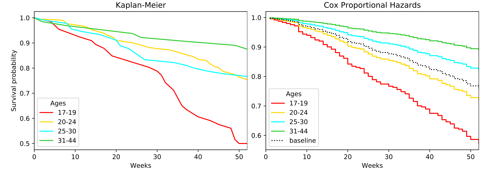
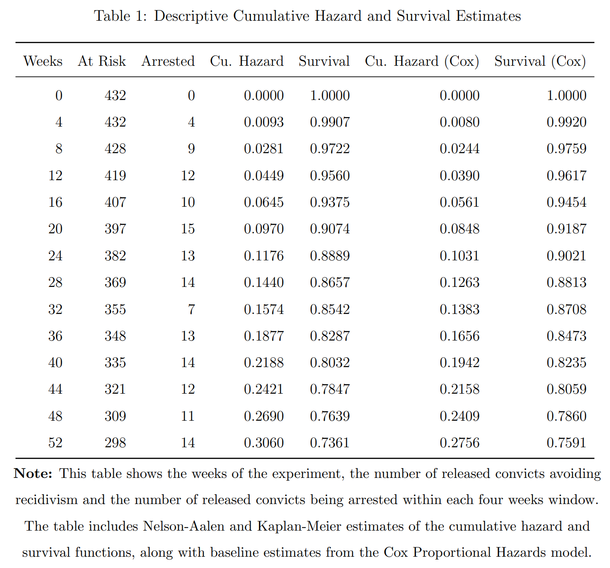
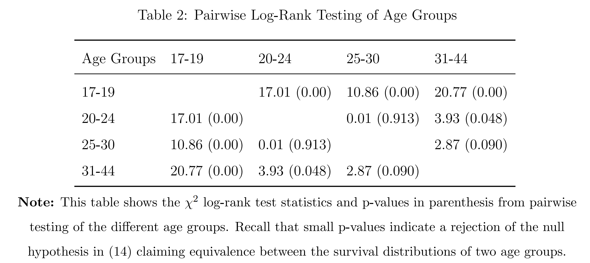
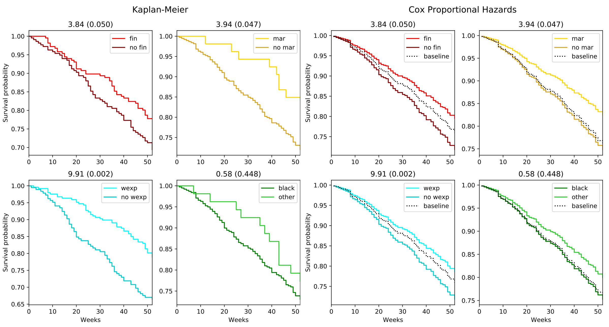
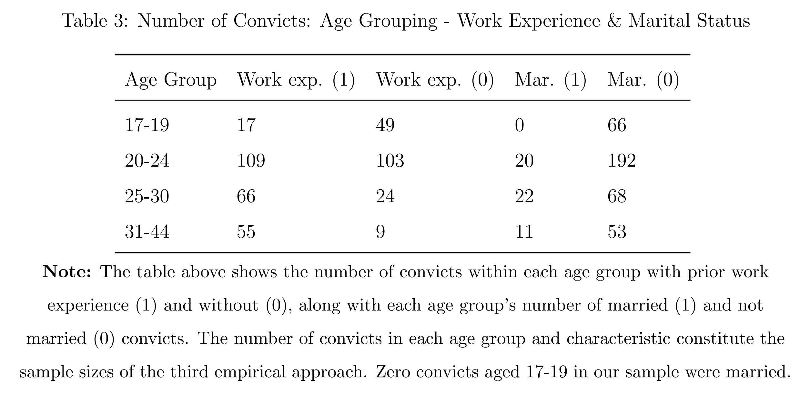
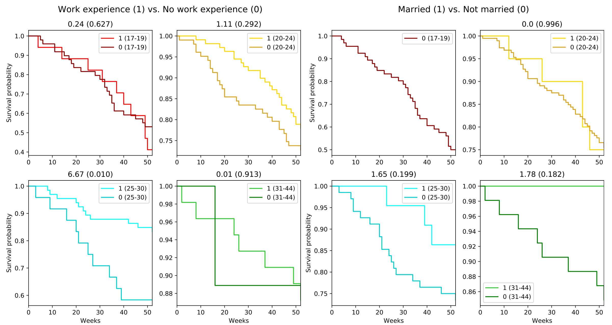

# Survival analysis of american ex-convicts
Recidivism rates of released american prisoners estimated with the survival functions of Kaplan-Meier and Cox proportional hazard. 

### The TARP Dataset
TARP was commissioned by the US Department of Labor in the late 1970s to investigate the effects of financial aid on criminal recidivism.

In one preliminary TARP experiment conducted on released convicts over 52 weeks, half of the convicts were randomly assigned to receive transitional financial aid transfers, while the other half would receive nothing. 

Demographic factors such as age, marital status, race and work experience of each released convict were noted in the experiment. 

At termination of the convicts 52 weeks experiment, the released convicts that had been rearrested had their number of weeks from release to rearrest noted, while the released convicts who had avoided rearrest remained censored in the data.

View the [TARP dataset here](dataset.xlsx). Only the variables of **week, arrest, fin, age, race, wexp, mar** were of interest to this project. 

These variables indicate the week of a potential rearrest, whether the convict received financial aid along with his age, race, prior work experience and current marital status.  

### Descriptive survival estimates following release

### First Approach: Age Grouping
As seen in the first image above, survival curves where estimated for specific age groups to see if age represents a significant variable in determining criminal recidivism.

Log-rank hypothesis tests can be carried out to statistically determine if two age groups have significantly different survival estimates. The log-rank null hypothesis states that the survival distributions of two different groups are the same. 

Indicated by small p-values, we find that some age groups indeed have significantly different survival distributions. 

### Second Approach: Characteristics Grouping
Instead of grouping convicts based on age, we now group convicts based on the following four characteristics:

Receiving financial aid or not (n1 = 216 vs. n0 = 216), being married or not (n1 = 53 vs. n0 = 379), having prior full-time work experience or not (n1 = 247 vs. n0 = 185) and finally, being of the African-American/Black race or not (n1 = 379 vs. n0 = 53).

Again, survival estimates and log-rank tests are computed for each variable/characteristics grouping. The log-rank test statistic (with p-value in parenthesis) are included above each subplot below: 

With this approach we find that racial background or receiving financial aid are **NOT** significant determinants of criminal recidivism, but marital status and prior work experience are. 

### Third Approach: Age Grouping Significant Characteristics
As a final survival analysis approach, an age grouping was done on a grouping of prior work experience and marital status:

The survival estimates for this grouping approach found that only in the age group of 25-30 year olds did prior work experience significantly improve the survival probability of ex-convicts: 

### Future extension
An extension to this project could involve applying the fitted Cox Proportional Hazards regression model to predict the survival distributions of released convicts. 

Instead of fitting the model on the entire data set, it would be interesting to leave out some percentage of observations when fitting the model and then investigate the model’s predictive ability on these observations. 

Such application may benefit real-world correctional facilities to better
target certain convicts with rehabilitation programs, if the individual demographic factors of
convicts expose them to significantly higher risks of criminal recidivism upon release.
